# ISAD251_Coursework
A web based application for ordering food in a tea room.

# Screenshots
### 1. Customer Ordering on **Chrome**
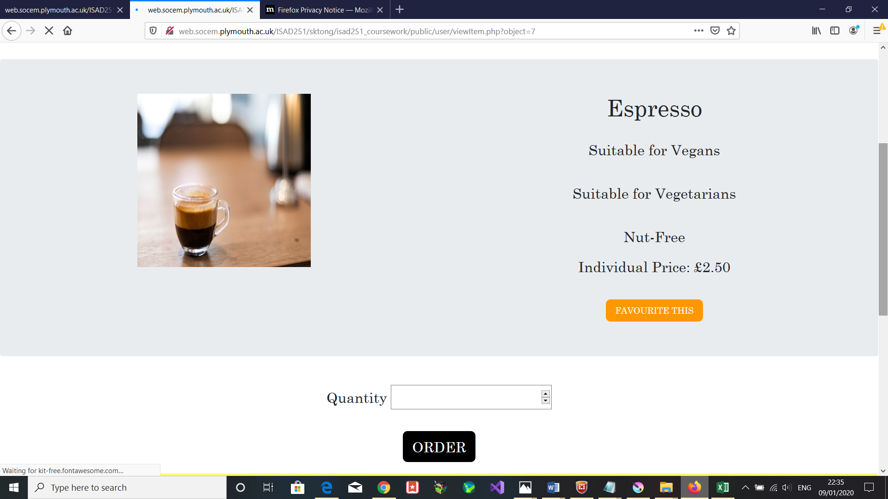

### 2.Admin Looking at Ongoing Orders on **Chrome**
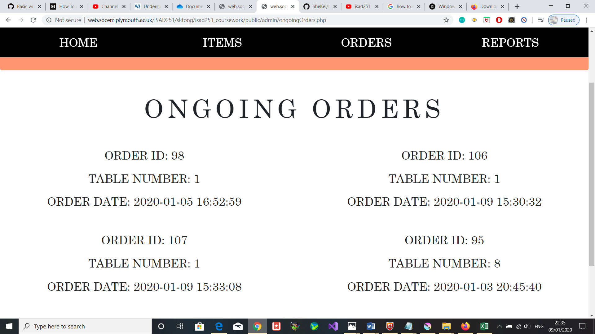

### 3. Admin looking at Restock Report on **Chrome**
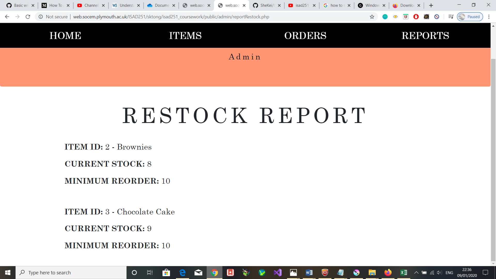

### 4. Admin Validation Error on **Firefox**
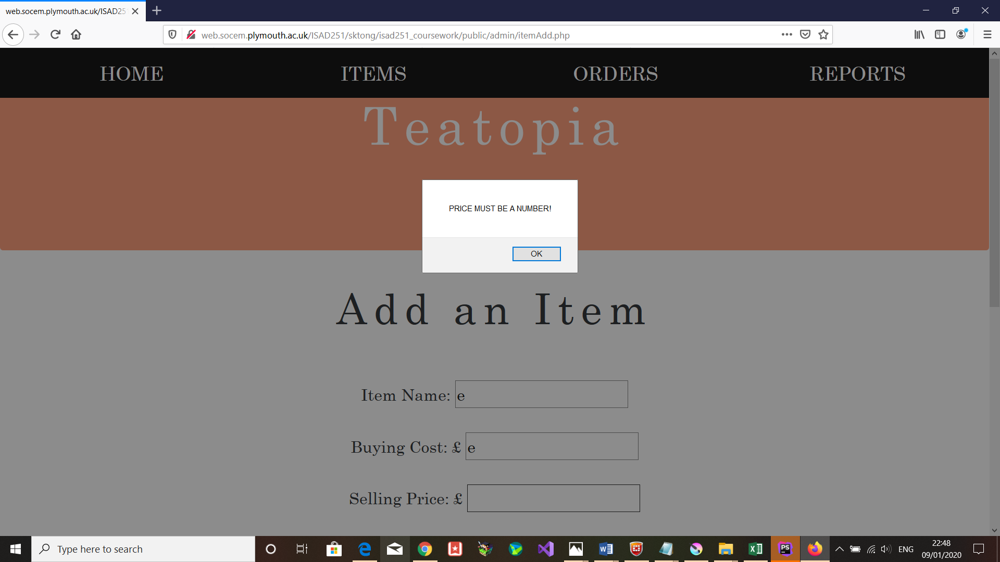

### 5. Overall Home Page on **Firefox**
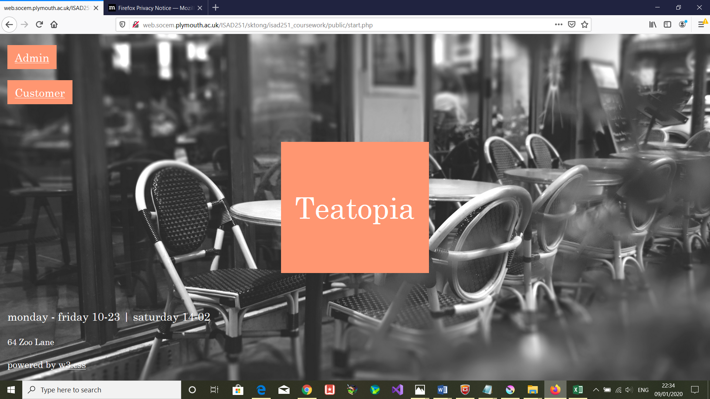

### 6. Confirmation Page of Leaving Session on **Microsoft Edge**
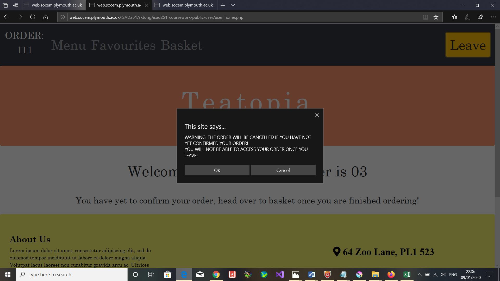

### 7. Choose a Table on **Microsoft Edge**
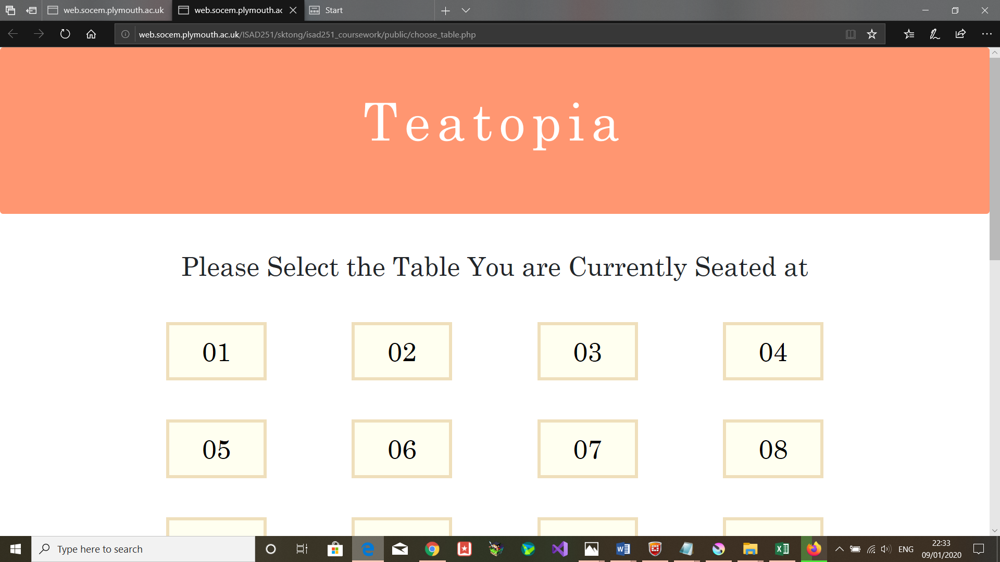

### 8. Home Page for Customers on **Microsoft Edge**
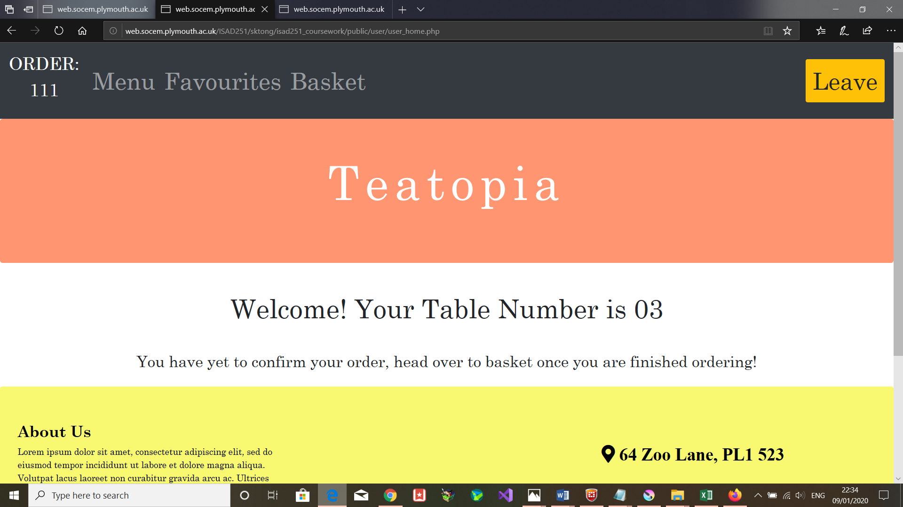

### 9. Home Page for Admins on **Microsoft Edge**
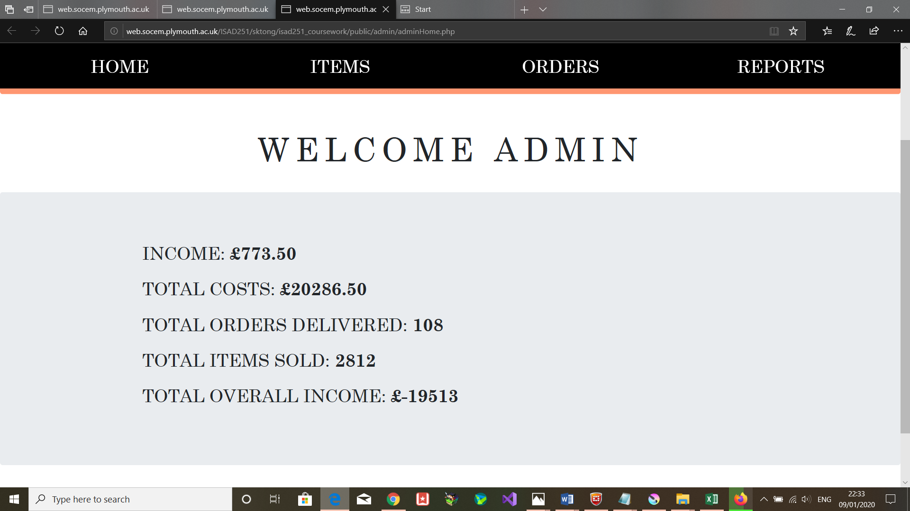

### 10. Customer Basket on **Firefox**
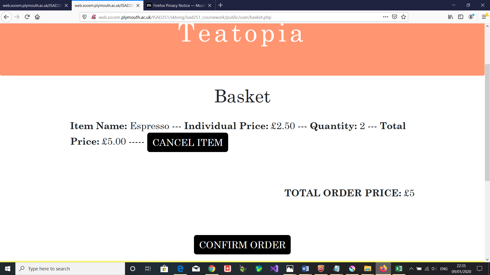

### 11. Viewing the Menu on **Firefox**
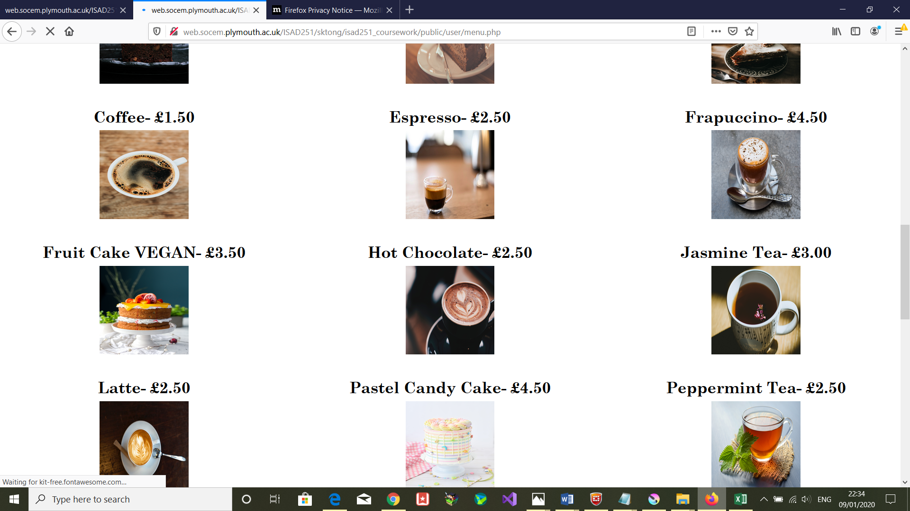

## Video Link

[Application Video ]( https://youtu.be/vVXeU8btaAY) – I’m very sorry but the video is over 2 minutes long, **please watch the video at x1.75 speed**

## Application Fact Sheet
Overall Features of this application:
1.	Use of tables as customer ordering identities
2.	Multiple Orders in one table session 
3.	Menu Filter 
4.	View Table’s Favourite items (& order from there)
5.	Cancel an order that is still ordering or confirmed
6.	Cancel an item in an order that is not yet confirmed
7.	Add/Edit an item with data validation
8.	Deliver Ongoing orders and have stock be updated automatically
9.	View reports on items, orders and income (+ custom search) 
The application consists of two user modes: Customer and Admin.

## **Customer Side:**
1.For customers, simply press the ‘Customer’ button on start.php and you will be taken to a page where you must select your table number that you are currently sat at – this cannot be changed once selected unless you cancel the order.

2.Customers can order items from two methods: either navigating to the menu page or navigating to the favourite page. Through the menu page, filtering can be applied to search for allergies and/or categories. 

3.The favourite page consists of items that customers who have sat at the same table and added an item as a favourite – this is done by clicking on an item where the order button and the favourite button will appear. 

4.Clicking on an item will display allergies and price details. The same item can be ordered repeatedly as long as the quantity input is valid (i.e. a positive integer).

5.To confirm an order, customers must navigate to the basket page – if the user does not confirm and presses the leave button to exit application, their order will be cancelled.

6.Once an order is confirmed but not yet delivered, customers can still cancel an order. 

 ## **Admin Side:**
1. For admins, simply press the ‘Admin’ button on start.php and you will be taken to the home page where a general income/deliveries report will greet you as well as the log out button. 
Admins are able to navigate to: Items, Orders, Reports and Home.

2. Admins can either view Sale, Withdrawn or All items and clicking on an individual item will view all details. Two buttons will be present: Change status of an item or edit an item.

3. Pressing the change status button will either withdraw an item or put it on sale depending on its original status.
4. Changes made to an edited item will only be saved if it is valid else an error message will be displayed. This is also the same for adding an item.

5. Admins can view ongoing orders by clicking on Orders on the nav bar. From there clicking on an order id will bring up the order items of that particular order. You will then be provided the option to deliver an order. Should you choose to deliver an order, that status will be updated to “Delivered” and the stock quantity will be automatically deducted from the order.

6. Click on the Reports page to view various reports on restocking, items and orders.

